# Vishal Yadav

<b>Cybersecurity Enthusiast</b> · B.Tech CSE Core · Lovely Professional University

## About me

I am a CSE student passionate about cybersecurity and practical problem solving. I learn by building projects, solving DSA problems, experimenting with technology, and writing clean, efficient code.

## Tech stack

`C` `C++` `Python` `JavaScript` `HTML` `CSS` `DBMS` `DSA` `VS Code` `Cursor`

## Currently learning

- DSA with C++
- Cybersecurity fundamentals
- Ethical hacking
- Network security

## Projects & experience

### Smart Safety Helmet + Accident Detection System

- Built a smart helmet prototype and connected mobile application.
- Detects accidents and can trigger emergency assistance or calling.
- Combines hardware and software to improve rider safety.

### Kaiser Power — Assistant Supervisor

One month in a Mechanical / Hydropower Plant environment, developing teamwork, coordination, discipline, and practical problem-solving skills.

## My vision

`CSE → Programming & DSA → Networks → Operating Systems → Cybersecurity → Ethical Hacking → Network Security → Security Projects → Cybersecurity Engineer`

My long-term goal is to work on large-scale technology and security challenges at Google or Amazon.

> Learn. Build. Secure. Improve.
